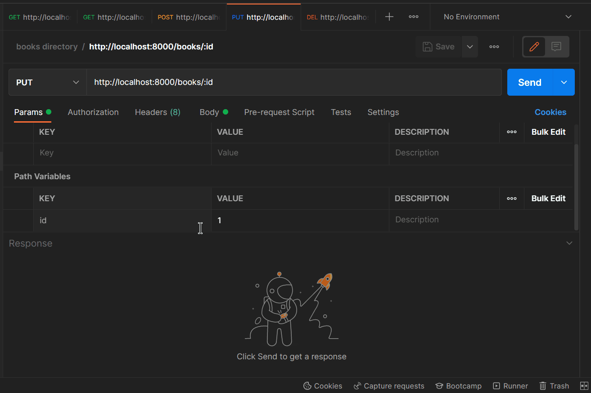

# Books Directory

* ## Problem Statement

```javascript
The most basic project you can create using Node.js and Express.js or Nest.js is a simple REST API.

For this purpose, I'd like to suggest you build a book directory, where you would need to create endpoints, using the four most basic methods: GET,POST, PUT and DELETE.

You'd use GET for getting all books or getting only one book by id. With the POST method, you can add a new book to the list. You'd need the PUT method for updating the existing book, and it's evident that with the DELETE method, you will remove the book from the list.

For this kind of application, you don't have to use
the database, and for the first app, you can start
with data collected as a JSON file.
```

* ## Installation Setup & Running

1. `git clone https://github.com/Aabhashzzz1/books-directory.git`
2. `cd books-directory`
3. `npm i (npm install)`
4. `To start the project` 
- _```Production Use```_
```javascript
npm start
```
- ```Development use```
```javascript
npm run dev
```
5. `Use Postman to check REST APIs calls`

* ## Demo

> **Get Request**

`Getting all the books data`


```javascript
router.get('/', (req,res) => {
    res.json(booksData);
});
```

`Getting only one or specific books data by id`


```javascript
router.get('/:id', (req,res) => {
    const { id } = req.params;
    res.json(booksData.filter((ele) => ele.id === parseInt(id)));
});
```

> **Post Request**

`Posting books data in json file/format`


```javascript
router.post('/', (req,res) => {
    const info = req.body;
    console.log(info);
    booksData.push(info);
    res.json({ message: 'The book has been uploaded.' });
});
```

> **Put Request**

`Putting/Updating books data in json file`



```javascript
router.put('/:id', (req,res) => {
    const { id } = req.params;
    const info = req.body;
    console.log(info);
    booksData.forEach((book, index) => {
        if (book.id === parseInt(id)) {
            booksData[index] = info;
        }
    });
    res.json({ message: `The book data with id ${id} has been updated` });
});
```

> **Delete Request**

`Deleting only one or specific books data by id`


```javascript
router.delete('/:id', (req,res) => {
    const { id } = req.params;
    booksData.forEach((book, index) => {
        if (book.id === parseInt(id)) {
            booksData.splice(index);
        }
    });
    console.log(booksData);
    res.json({ message: `The book data with id ${id} has been deleted` });
});
```